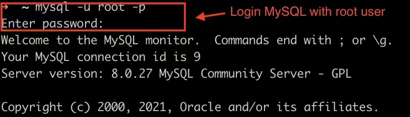
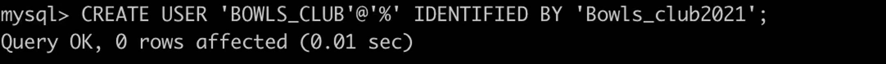
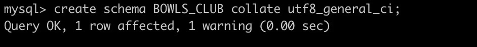
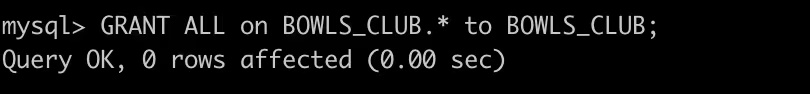
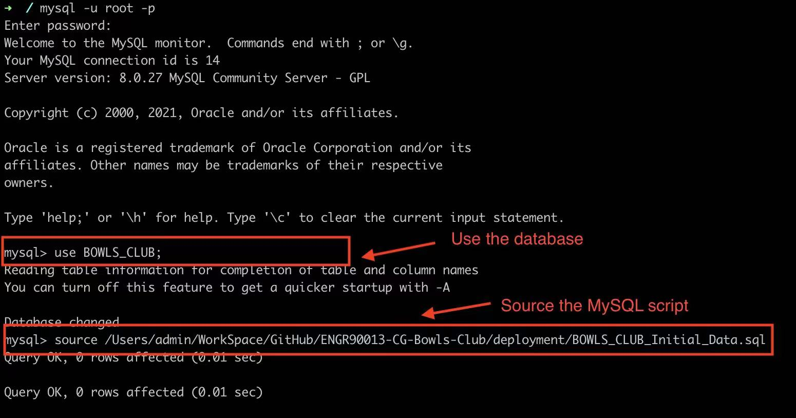
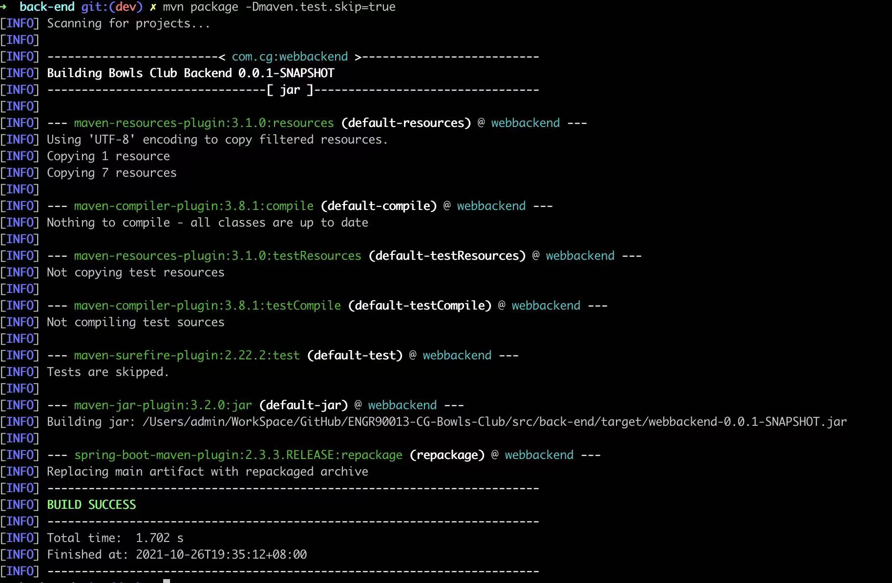
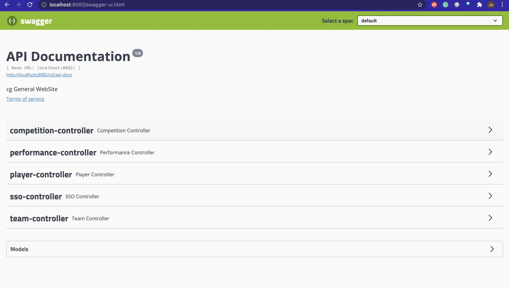
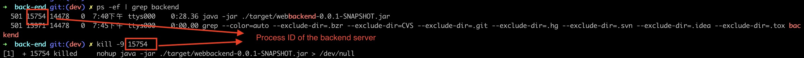

# ENGR90013-CG-Bowls-Club
## 1. Project Description
This project is motived by Mulgrave Country Club Lawn Bowls Section, which aims to perform the digital transmission of the manual process for the weekly team selection of Bowl games. The technical support is provided by the teams from School of Engineering and IT of, University of Melbourne.


## 2. Project Documents(Exported from Conluence)
(TO BE UPDATED)
## 3. Deployed Application
- Application URL: http://128.199.253.108:3000/home
- Username and Password for Admin privilege
  - username(Email): admin
  - password: admin
  
- Username and Password for Selector privilege
  - username: selector
  - password: selector
- Access to server
  - SSH teamcg@128.199.253.108
  - Password: teamcg
- Access to MySQL database
  -  IP: 128.199.253.108
  - Schema Name: BOWLS_CLUB
  - Username: BOWLS_CLUB
  - Password: Bowls_club2021
  - JDBC URL: mysql://128.199.253.108:3306/BOWLS_CLUB 
  - Scripts for schema and initial data: [BOWLS_CLUB_Initial_Data](./deployment/BOWLS_CLUB_Initial_Data.sql)
- API details:
  - For overview and online test: http://128.199.253.108:8082/swagger-ui.html#/
  - More detailed decription of APIs can be found at the project documents documents, under Design/Application Programming Interface page
  
## 4. How to deploy the application
This is a guideline for how to deployed the product on another server. Feel free to contact Zijian Ju(zijianju98@gmail.com) if there is any issues.
### 4.1 Environment Requirement and Installation Resource
-  Linux server with 'curl', 'unzip' command installed
-  ***[Java 11](https://www.javahelps.com/2017/09/install-oracle-jdk-9-on-linux.html)*** for compiling and running the backend server
-  ***[MySQL 5.6+](https://dev.mysql.com/doc/refman/8.0/en/linux-installation.html)***  for data stroage
-  Latest version of ***Maven*** for compiling the SprintBoot project (see the corresponding link for [download](https://maven.apache.org/download.cgi) and [install](https://maven.apache.org/install.html))
-  ***iptables*** for manage the network access from public internet. (see the corresponding link for installaion on [CentOS](https://docs.rackspace.com/support/how-to/use-iptables-with-centos-7/) and [Ubuntu](https://askubuntu.com/questions/692278/how-to-install-iptables-in-ubuntu))
-  **\[Frontend\](TO BE UPDATED)**
### 4.2 Deployment Process
- Download source code
  - Go to home directory
    ```
    cd ~
    ```
  - Download zipped source code
    ```
    curl -LJO https://github.com/Zijian-Ju/ENGR90013-CG-Bowls-Club/archive/refs/tags/v4.0.zip
    ```
  - Unzip the file 
    ```
    unzip ENGR90013-CG-Bowls-Club-4.0.zip
    ```
  - Direct to the extracted folder
    ```
      cd ./ENGR90013-CG-Bowls-Club-4.0
    ```
- Deploy MySQL server
  - Download and setup MySQL database (see [official instalmylation guide](https://dev.mysql.com/doc/refman/8.0/en/linux-installation.html)), remember the password of the root user.
  - Login to the MySQL process by command, and type in the password:
    ```
    mysql -u root -p
    ```
    
  - Create new user
    ```
    CREATE USER 'BOWLS_CLUB'@'%' IDENTIFIED BY 'Bowls_club2021';
    ```
    
  - Create schema named as BOWLS_CLUB:
    ```
    Create schema BOWLS_CLUB collate utf8_general_ci; 
    ```
    
  - Grant privilege to the user
    ```
    GRANT ALL on BOWLS_CLUB.* to BOWLS_CLUB;
    ```
    
  - Then use the database:
    ```
    use BOWLS_CLUB;
    ```
  - Finally execute the MySQL script for importing the initial data
    ```
    source ~/ENGR90013-CG-Bowls-Club-4.0/deployment/BOWLS_CLUB_Initial_Data.sql
    ```
    
- Deploy Backend Server
  - Install [Maven](https://docs.wso2.com/display/IS323/Installing+Apache+Maven+on+Linux) (Click the link to see instructions)
  - Direct to the backend source code folder
    ```
    cd ~/ENGR90013-CG-Bowls-Club-4.0/src/back-end
    ```
  - Use maven build the project
    ```
    mvn package -Dmaven.test.skip=true
    ```
    
  - Run the proejct by execute below command on Terminal
    ```
    nohup java -jar ~/ENGR90013-CG-Bowls-Club-4.0/src/back-end/target/webbackend-0.0.1-SNAPSHOT.jar 1>/dev/null &
    ```
    
    When the server is started, the process ID will return.
    Now you have successfully setup the backend server. Access [localhost:8082/swagger-ui.html](localhost:8082/swagger-ui.html) can have a look with the API documentation.
     
  - To stop the server, firstly execute
    ```
    ps -ef | grep backend
    ```
    to get the processID of the backend server and then execute
    ```
    kill -9 {processID}
    ```
    to stop the process
    
- Deploy Front-End Server
  - Install [Node](https://docs.npmjs.com/downloading-and-installing-node-js-and-npm) (Click the link to see instructions)
  - Navigate to the frontend folder
    ```
    cd ~/ENGR90013-CG-Bowls-Club-4.0/src/front-end
    ```
  - Install node packages
    ```
    npm install
    ```
  - Start frontend server (optional)
    ```
    npm start
    ```
  - A browser window will open with access to the loaded frontend.The site can be manually reached at [http://localhost:3000]
  - Build frontend for external deployment. 
    ```
    npm run build
    ```
- Use iptables to allow public accessto the webpage(TO BE UPDATED)

Feel free to contact Zijian Ju (Zijianju98@gmail.com) for furthur assistance

## Contributors
- Scrum Master: Sin I Von
- Product Owner: Thomas Capicchiano
- Backend Development: Zijian Ju, Lingjun Meng, Yutong Li
- Frontend Development: Kevin Xu, Zhiyuan Deng
- Quality Assurance: Lien Zhou, Anuradua Gupta
- Risk Management: Lize Qin
- Deployment: Zijian Ju, Kevin Xu
